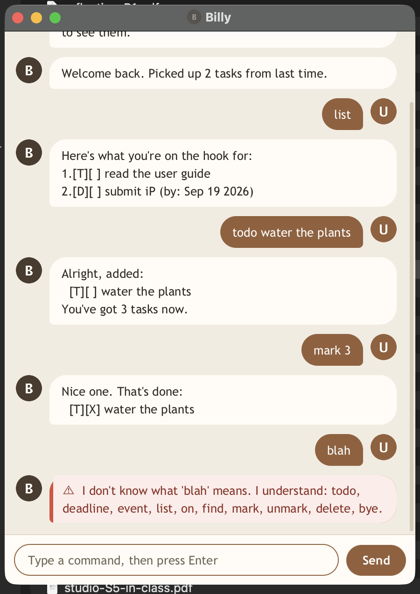

# Billy

Billy is a desktop chatbot that keeps track of your tasks, and has rather more
to say about them than it strictly needs to.



It handles three kinds of task — **todos**, **deadlines** and **events** — and
can list them, search them, mark them done and delete them. Your list is saved
to `data/billy.txt` after every change and read back the next time Billy starts,
so closing the window never loses it.

The full instructions are in the **[user guide](https://aayanvatsa04.github.io/ip/)**
(also readable [here in the repository](docs/README.md)).

## Running Billy

With [JDK 25](https://www.oracle.com/java/technologies/downloads/) installed:

```
./gradlew run
```

To build the jar a grader would run instead:

```
./gradlew shadowJar
java -jar build/libs/billy.jar
```

Billy also runs as a plain console conversation, which is what the text UI tests
drive: `java -cp build/classes/java/main billy.Billy`.

## Setting up in Intellij

Prerequisites: JDK 25, update Intellij to the most recent version.

1. Open Intellij (if you are not in the welcome screen, click `File` > `Close Project` to close the existing project first)
1. Open the project into Intellij as follows:
   1. Click `Open`.
   1. Select the project directory, and click `OK`.
   1. If there are any further prompts, accept the defaults.
1. Configure the project to use **JDK 25** (not other versions) as explained in [here](https://www.jetbrains.com/help/idea/sdk.html#set-up-jdk).<br>
   In the same dialog, set the **Project language level** field to the `SDK default` option.
1. After that, locate the `src/main/java/billy/Billy.java` file, right-click it, and choose `Run Billy.main()` (if the code editor is showing compile errors, try restarting the IDE). If the setup is correct, you should see something like the below as the output:
   ```
    ____  _ _ _       
   | __ )(_) | |_   _ 
   |  _ \| | | | | | |
   | |_) | | | | |_| |
   |____/|_|_|_|\__, |
                |___/ 
   ```

**Warning:** Keep the `src\main\java` folder as the root folder for Java files (i.e., don't rename those folders or move Java files to another folder outside of this folder path), as this is the default location some tools (e.g., Gradle) expect to find Java files.
